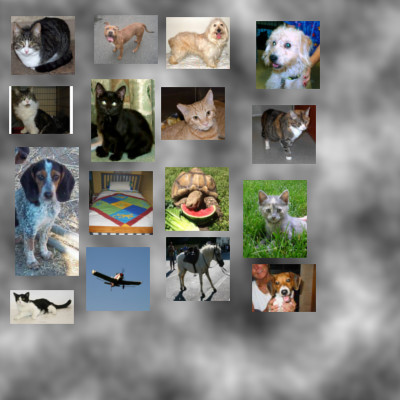
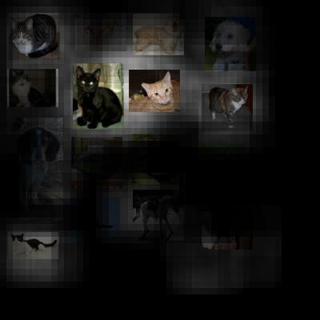
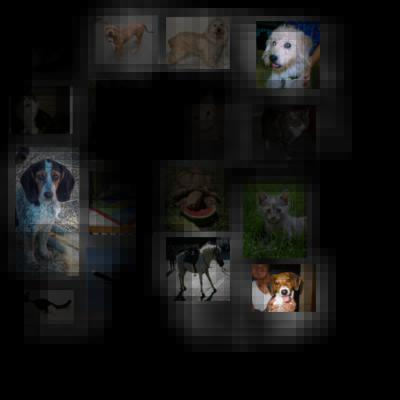

# CatDog

A simple solution to the Dogs vs. Cat problem using TFLearn a higher level API for Tensorflow

# Result

With a little time of training on 15000 images (of dogs, cat and other random images). With this model you can get an accuracy of approximatively 90% on the training data set and 80% on the test set.

## Example

With this input image :

You can separate dogs and cats like this:

### CATS

### DOGS

As you can see there is one cat detected as a dog. It's probably because the cat is on the grass and in the dataset used for the training most of cats are seen inside whereas dogs can be found outside in green background, and this model is sensitive to the color information.

# Usage

* run.py : start the learning
Put input images in a folder img/input/cat, img/input/dog and img/input/other
 
 * reco.py : separate cat and dogs on the input image (img/test.jpg by default)
